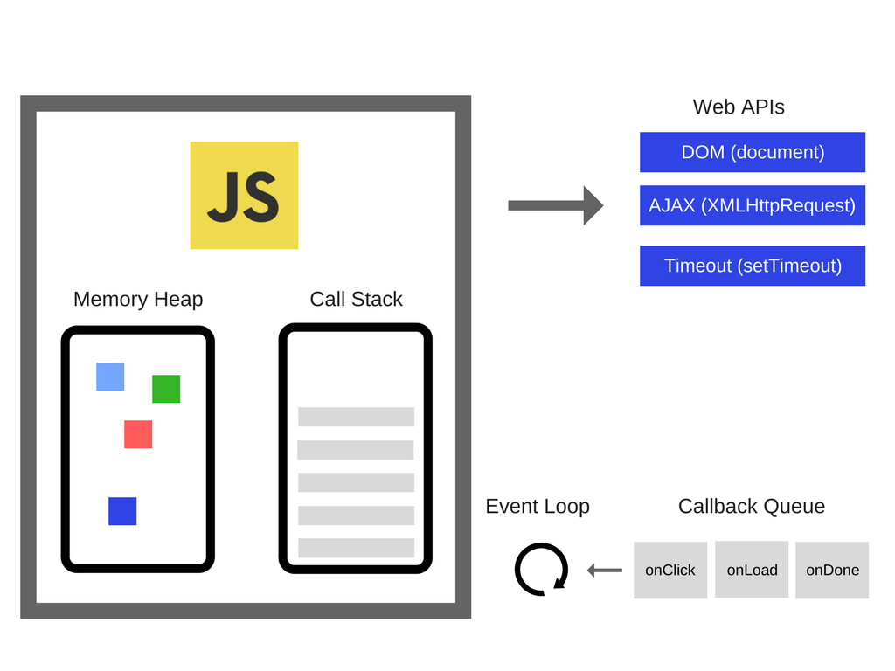
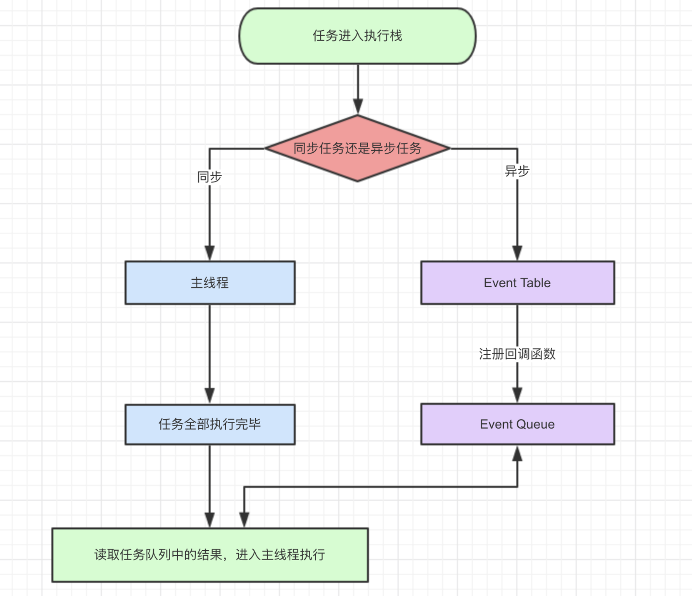

### 面试题之Event Loop终极篇


先上一道常见的笔试题

```javascript
console.log('1');
async function async1() {
    console.log('2');
    await async2();
    console.log('3');
}
async function async2() {
    console.log('4');
}

process.nextTick(function() {
    console.log('5');
})

setTimeout(function() {
    console.log('6');
    process.nextTick(function() {
        console.log('7');
    })
    new Promise(function(resolve) {
        console.log('8');
        resolve();
    }).then(function() {
        console.log('9')
    })
})

async1();

new Promise(function(resolve) {
    console.log('10');
    resolve();
}).then(function() {
    console.log('11');
});
console.log('12');
```

大家可以先配合下面这个图片思考一下输出顺序及这么运行的原因




上面简化图解可拆分为三部分：

#### 一、JavaScript引擎

*Memory Heap 内存堆 —— 这是内存发生分配的地方

*Call Stack 调用栈 —— 这是代码运行时栈帧存放的位置


#### 二、Runtime 运行时

我们要知道的是，像setTimeOut DOM AJAX，都不是由JavaScript引擎提供，而是由浏览器提供，统称为Web APIs


#### 三、EventLoop

##### 1、关于javascript

javascript是一门**单线程**语言，虽然HTML5提出了Web-works这样的多线程解决方案，但是并没有改变JaveScript是单线程的本质。

> 什么是H5 Web Works？
>
> 就是将一些大计算量的代码交由web Worker运行而不冻结用户界面，但是子线程完全受主线程控制，且不得操作DOM。所以，这个新标准并没有改变JavaScript单线程的本质


##### 2、javascript事件循环

既然js是单线程的，就是同一时间只能做一件事情。那么问题来了，我们访问一个页面，这个页面的初始化代码运行时间很长，比如有很多图片、视频、外部资源等等，难道我们也要一直在那等着吗？答案当然是 不能

所以就出现了两类任务：

- 同步任务

- 异步任务 

  




1. 同步和异步任务分别进入不同的 '‘场所'’ 执行。所有同步任务都在主线程上执行，形成一个执行栈；而异步任务进入Event Table并注册回调函数
2. 当这个异步任务有了运行结果，Event Table会将这个回调函数移入Event Queue，进入等待状态
3. 当主线程内同步任务执行完成，会去Event Queue读取对应的函数，并结束它的等待状态，进入主线程执行
4. 主线程不断重复上面3个步骤，也就是常说的Event Loop(事件循环)。


> 那么我们怎么知道什么时候主线程是空的呢？
>
> js引擎存在monitoring process进程，会持续不断的检查主线程执行栈是否为空，一旦为空，就会去Event Queue那里检查是否有等待被调用的函数。


##### 3、setTimeout和setInterval

`setTimeout(fn,0)`这里的延迟0秒时什么意思呢？

含义是，当主线程执行栈内为空时，不用等待，就马上执行。


setInterval和setTimeout类似，只是前者是循环的执行。对于执行顺序来说，`setInterval`会每隔指定的时间将注册的函数置入Event Queue，如果前面的任务耗时太久，那么同样需要等待。

对于`setInterval(fn,ms)`来说，我们已经知道不是每过`ms`秒会执行一次`fn`，而是每过`ms`秒，会有`fn`进入Event Queue。一旦**setInterval的回调函数fn执行时间超过了延迟时间ms，那么就完全看不出来有时间间隔了**。


##### 4、promise和process.nextTick与async/await

事件循环的顺序，决定js代码的执行顺序。进入整体代码(宏任务)后，开始第一次循环。接着执行所有的微任务。然后再次从宏任务开始，找到其中一个任务队列执行完毕，再执行所有的微任务。


除了广义的同步任务和异步任务，我们对任务有更精细的定义：

- macro-task(宏任务)：包括整体代码script、setTimeout、setInterval、I/O、UI交互事件，可以理解是每次执行栈执行的代码就是一个宏任务；
- micro-task(微任务)：Promise，process.nextTick，且process.nextTick优先级大于promise.then。可以理解是在当前 task 执行结束后立即执行的任务；


setTimeout(fn, 0)在下一轮“事件循环”开始时执行，Promise.then()在本轮“事件循环”结束时执行。

不同类型的任务会进入对应的Event Queue：

Promise中的异步体现在`then`和`catch`中，所以写在Promise中的代码是被当做同步任务立即执行的。


await实际上是一个让出线程的标志。**await后面的表达式会先执行一遍，将await后面的代码加入到microtask中**，然后就会跳出整个async函数来执行后面的代码；

> 因为async await 本身就是promise+generator的语法糖。所以await后面的代码是microtask。


下面开始分析开头的代码

```javascript
console.log('1');
async function async1() {
    console.log('2');
    await async2();
    console.log('3');
}
async function async2() {
    console.log('4');
}

process.nextTick(function() {
    console.log('5');
})

setTimeout(function() {
    console.log('6');
    process.nextTick(function() {
        console.log('7');
    })
    new Promise(function(resolve) {
        console.log('8');
        resolve();
    }).then(function() {
        console.log('9')
    })
})

async1();

new Promise(function(resolve) {
    console.log('10');
    resolve();
}).then(function() {
    console.log('11');
});
console.log('12');
```


第一轮事件循环流程：

- 整体`script`作为第一个宏任务进入主线程，遇到`console.log`，输出1
- 遇到`async1、async2`函数声明，声明暂时不用管
- 遇到`process.nextTick()`，其回调函数被分发到微任务Event Queue中。我们记为`process1`
- 遇到`setTimeout`，其回调函数被分发到宏任务Event Queue中。我们暂且记为`setTimeout1`
- 执行`async1`，遇到`console.log`，输出2

**下面这里是最难理解的地方**

我们知道使用 **async** 定义的函数，当它被调用时，它返回的是一个Promise对象

而当await后面的表达式是一个Promise时，它的返回值实际上是Promise的回调函数resolve的参数


- 遇到`await async2()`调用，发现async2也是一个 async 定义的函数，所有直接执行输出4，同时返回了一个Promise。**划重点：此时返回的Promise被分配到微任务Event Queue中，我们记为await1。await会让出线程，接下来就会跳出async1函数继续往下执行。 **

  

- 遇到`Promise`，`new Promise`直接执行，输出10。`then`被分发到微任务Event Queue中。我们记为`then1`

- 遇到`console.log`，输出12

| **宏任务Event Queue** | **微任务Event Queue** |
| --------------------- | --------------------- |
| setTimeout1           | process1              |
|                       | await1                |
|                       | then1                 |

上表是第一轮事件循环宏任务结束时各Event Queue的情况，此时已经输出了1 2 4 10 12 

我们发现了`process1`、`await1 `和`then1`三个微任务

- 执行`process1`,输出5

- 取到 `await1` ，就是 async1 放进去的Promise，执行Promise时发现又遇到了他的真命天子resolve函数，**划重点：这个resolve又会被放入微任务Event Queue中，我们记为await2，然后再次跳出 async1函数 继续下一个任务。**
- 执行`then1`，输出11

| **宏任务Event Queue** | **微任务Event Queue** |
| --------------------- | --------------------- |
| setTimeout1           | await2                |

到这里，已经输出了1 2 4 10 12 5 11 

此时还有一个`await2 `微任务

它是**async1 放进去的Promise的resolve回调**，执行它（因为 async2 并没有return东西，所以这个resolve的参数是undefined），此时 await 定义的这个 Promise 已经执行完并且返回了结果，所以可以继续往下执行 async1函数 后面的任务了，那就是`console.log(3)`，输出3

到这里，第一轮事件循环结束，此时，输出顺序是 1 2 4 10 12 5 11 3


第二轮时间循环从`setTimeout1`宏任务开始

- 遇到`console.log`，输出6
- 遇到`process.nextTick()`，同样将其分发到微任务Event Queue中，记为`process2`
- 遇到`new Promise`立即执行输出8，`then`也分发到微任务Event Queue中，记为`then2 `

| **宏任务Event Queue** | **微任务Event Queue** |
| --------------------- | --------------------- |
|                       | process2              |
|                       | then2                 |

上表是第二轮事件循环宏任务结束时各Event Queue的情况，此时输出情况是 

我们发现了`process2`和`then2`两个微任务

- 执行`process2`,输出7
- 执行`then2`，输出9

第二轮事件循环结束，第二轮输出6 8 7 9 


整段代码，共进行了两次事件循环，完整的输出 1 2 4 10 12  5 11 3 6 8 7 9 


### 四、写在最后

到这里，大家应该已经清楚了JS的事件循环机制，后面不管在工作还是面试中，肯定都是游刃有余啦～

本篇是我开始的第一篇文章，还希望大家多多支持，不吝赐教哇，也希望可以提出意见或建议。


资料参考：

<https://segmentfault.com/a/1190000015057278>

<https://juejin.im/post/59e85eebf265da430d571f89#heading-4>

<https://www.oschina.net/translate/how-does-javascript-actually-work-part-1>


 

